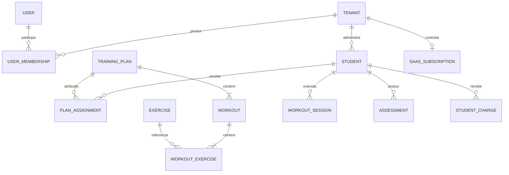

# Modelo conceitual de dados

## Visão

## Entidades essenciais

| Entidade | Finalidade |
|---|---|
| Tenant | conta operacional do personal |
| User | identidade autenticável |
| UserMembership | papel e vínculo do usuário ao tenant |
| Student | perfil do aluno dentro do tenant |
| Exercise | exercício global importado ou próprio do tenant |
| TrainingPlan/Workout | prescrição reutilizável e versionável |
| PlanAssignment | versão atribuída ao aluno e vigência |
| WorkoutSession | execução preservando a prescrição vigente |
| Assessment | evolução manual e anexos opcionais |
| StudentCharge | controle manual de cobrança do aluno |
| SaaSSubscription | assinatura do personal para usar o FitOS |
| AuditEvent | alteração crítica com ator, instante e contexto |

## Restrições conceituais

- `StudentCharge.status`: `pendente`, `pago`, `atrasado`, `cancelado`.
- "A vencer" é apresentação calculada, não estado.
- plano atribuído e sessão preservam versão histórica.
- exercício importado preserva origem e conteúdo original.
- exclusão lógica/arquivamento preserva histórico quando exigido pelo domínio.
- campos clínicos e financeiros não entram em logs de aplicação.

O schema físico, índices, constraints e estratégia de migrations serão definidos em História posterior.
