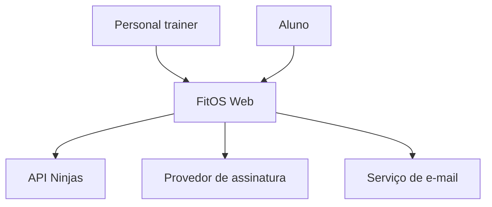
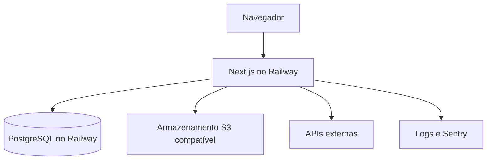

# Visão arquitetural

## Princípios

- monólito modular para reduzir complexidade operacional no MVP;
- segurança e isolamento aplicados no servidor, nunca confiados ao cliente;
- PostgreSQL como fonte transacional de verdade;
- integrações externas atrás de adaptadores internos;
- operações críticas idempotentes e auditáveis;
- evolução para serviços separados somente mediante evidência de necessidade.

## Contexto

## Containers

## Módulos do monólito

| Módulo | Responsabilidade |
|---|---|
| Identidade | usuários, sessões, recuperação e convite |
| Tenancy | personal, vínculos e contexto do tenant |
| Alunos | cadastro, status e perfil |
| Exercícios | catálogo local, próprios e importados |
| Treinos | modelos, planos, versões e atribuições |
| Execução | sessões, séries e histórico |
| Evolução | avaliações, medidas e fotos opcionais |
| Financeiro do aluno | lançamentos e baixa manual |
| Assinatura SaaS | plano do FitOS e situação de acesso |
| Integrações | API Ninjas, cobrança, e-mail e arquivos |
| Auditoria | eventos críticos de negócio e segurança |

Módulos não acessam tabelas alheias por atalhos não documentados. Dependências devem ocorrer por serviços internos e contratos explícitos.

## Stack direcionadora

Next.js, TypeScript, M3, PostgreSQL, Prisma, Railway, Vitest, Playwright, Sentry e GitHub Actions. Versões e bibliotecas auxiliares serão fixadas na História de fundação do código.
